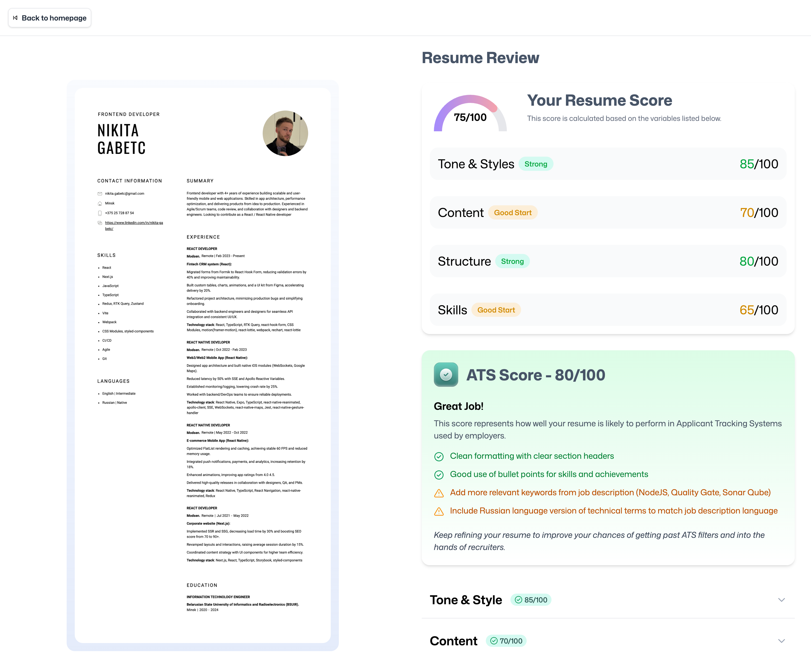
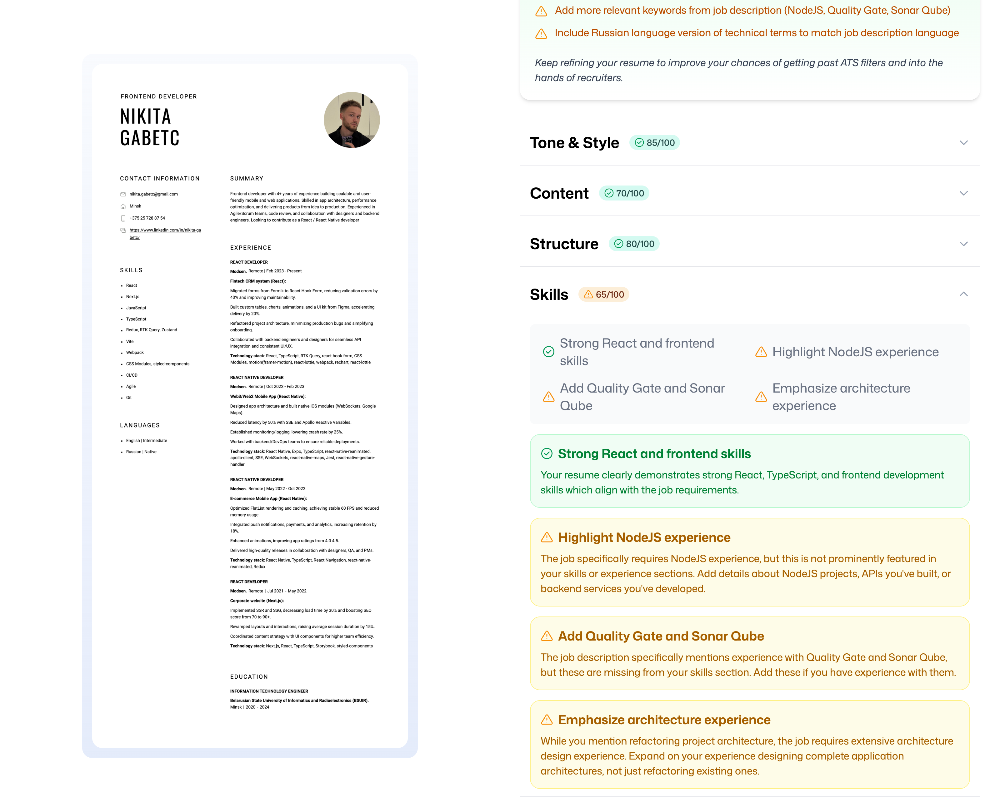

# AI Resume Analyzer

Веб-приложение для анализа резюме с использованием искусственного интеллекта. Приложение предоставляет детальную оценку резюме по различным критериям и рекомендации по улучшению для повышения шансов прохождения ATS (Applicant Tracking System) фильтров.

## 📸 Скриншоты

### Главная страница


_Список всех проанализированных резюме с общими оценками_

### Страница загрузки


_Форма для загрузки нового резюме с указанием контекста вакансии_

### Результаты анализа


_Детальный анализ резюме с оценками по категориям и рекомендациями_

### Детальная обратная связь


_Подробные рекомендации по улучшению с объяснениями_

## 🎯 Основные возможности

### 📊 Комплексный анализ резюме

- **Общая оценка** - общий балл резюме от 0 до 100
- **ATS Score** - оценка совместимости с системами отслеживания кандидатов
- **Анализ по категориям**:
  - Тон и стиль написания
  - Содержание и релевантность
  - Структура и организация
  - Навыки и компетенции

### 🤖 AI-анализ с учетом контекста

- Анализ резюме с учетом конкретной вакансии
- Персонализированные рекомендации по улучшению
- Детальные объяснения по каждому пункту обратной связи
- Разделение на положительные моменты и области для улучшения

### 📁 Управление резюме

- Загрузка PDF файлов резюме
- Автоматическое преобразование PDF в изображения для предварительного просмотра
- Сохранение истории анализов
- Отслеживание заявок на разные позиции

### 🔐 Безопасность и аутентификация

- Интеграция с Puter.js для аутентификации
- Безопасное хранение файлов и данных
- Персональные аккаунты пользователей

## 🛠 Технологический стек

### Frontend

- **React 19** - современная библиотека для создания пользовательских интерфейсов
- **React Router 7** - маршрутизация с серверным рендерингом
- **TypeScript** - типизированный JavaScript для надежности кода
- **Tailwind CSS 4** - utility-first CSS фреймворк
- **Zustand** - легковесное управление состоянием

### Backend & Интеграции

- **Puter.js** - облачная платформа для:
  - Аутентификации пользователей
  - Хранения файлов (FS API)
  - AI-анализа через Claude 3.7 Sonnet
  - Key-Value хранилища для данных
- **PDF.js** - обработка и конвертация PDF файлов
- **React Dropzone** - drag & drop загрузка файлов

### Инструменты разработки

- **Vite** - быстрый сборщик и dev-сервер
- **ESLint** - линтинг кода
- **Prettier** - форматирование кода

## 🚀 Функциональность

### Процесс анализа резюме

1. **Загрузка** - пользователь загружает PDF резюме
2. **Контекст** - указывает название компании, должность и описание вакансии
3. **Обработка** - система конвертирует PDF в изображение для предварительного просмотра
4. **AI-анализ** - Claude AI анализирует резюме с учетом контекста вакансии
5. **Результаты** - пользователь получает детальную оценку и рекомендации

### Интерфейс пользователя

- **Главная страница** - список всех проанализированных резюме
- **Страница загрузки** - форма для загрузки нового резюме
- **Страница результатов** - детальный анализ с визуализацией оценок
- **Аутентификация** - простая система входа через Puter.js

### Визуализация данных

- Круговые диаграммы для общих оценок
- Цветовая индикация (зеленый/желтый/красный) для разных уровней
- Аккордеон-интерфейс для детального просмотра рекомендаций
- Бейджи с оценками для быстрого понимания

## 📱 Адаптивный дизайн

- Полностью адаптивный интерфейс для всех устройств
- Современный градиентный дизайн
- Анимации и плавные переходы
- Интуитивно понятная навигация

## 🚀 Быстрый старт

### Установка

Установите зависимости:

```bash
npm install
```

### Разработка

Запустите сервер разработки с HMR:

```bash
npm run dev
```

Приложение будет доступно по адресу `http://localhost:5173`.

## 🎨 Дизайн и стилизация

Приложение использует современный дизайн с:

- **Tailwind CSS 4** - для стилизации компонентов
- **Кастомные градиенты** - для создания визуально привлекательного интерфейса
- **Адаптивная верстка** - для всех типов устройств
- **Анимации** - для улучшения пользовательского опыта

## 🔧 Конфигурация

### Переменные окружения

Приложение использует Puter.js для бэкенд-функциональности. Убедитесь, что у вас есть доступ к Puter.js API.

### Структура проекта

```
app/
├── components/          # React компоненты
├── routes/             # Страницы приложения
├── lib/                # Утилиты и интеграции
├── types/              # TypeScript типы
└── constants/          # Константы и конфигурация
```

## 📈 Возможности для развития

- Интеграция с дополнительными AI моделями
- Экспорт результатов анализа в PDF
- Шаблоны резюме
- Сравнение нескольких резюме
- Статистика и аналитика
- Интеграция с LinkedIn

---

Создано с ❤️ используя React Router и современные веб-технологии.
